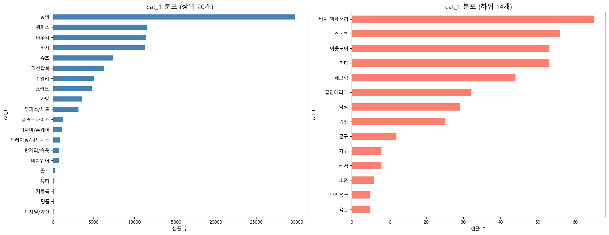
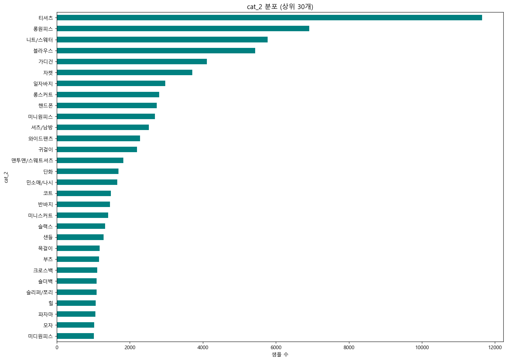
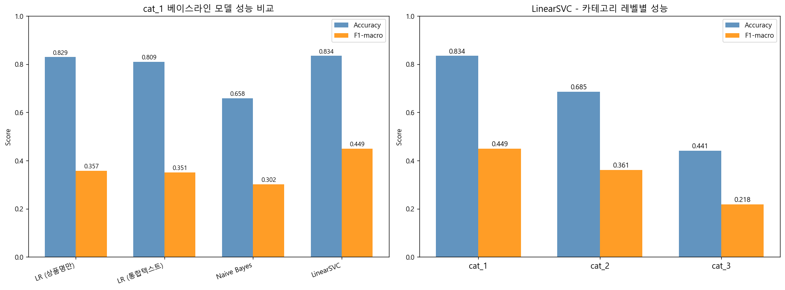
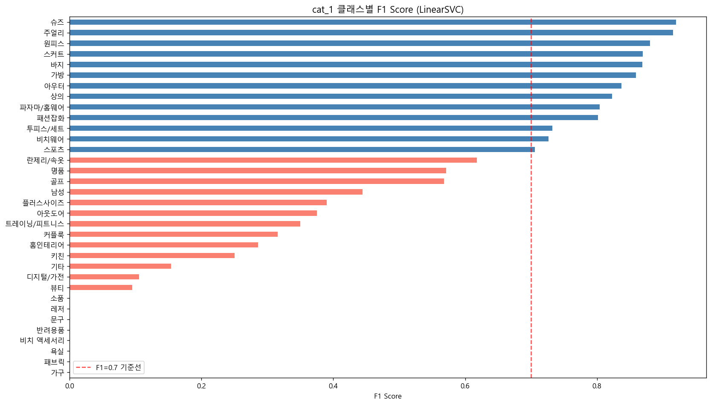
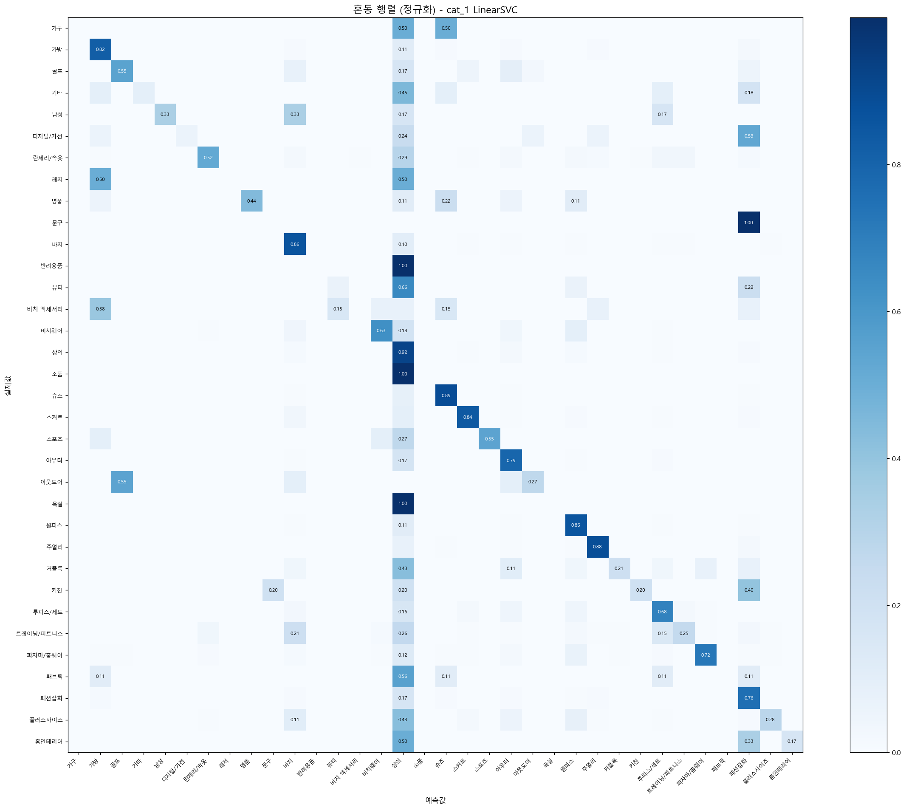
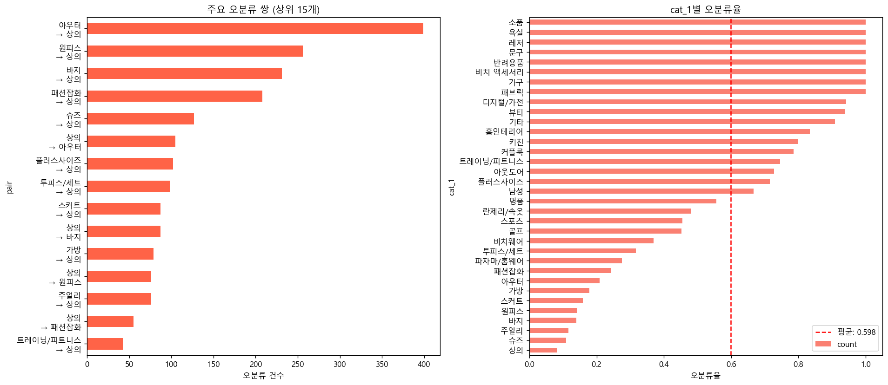
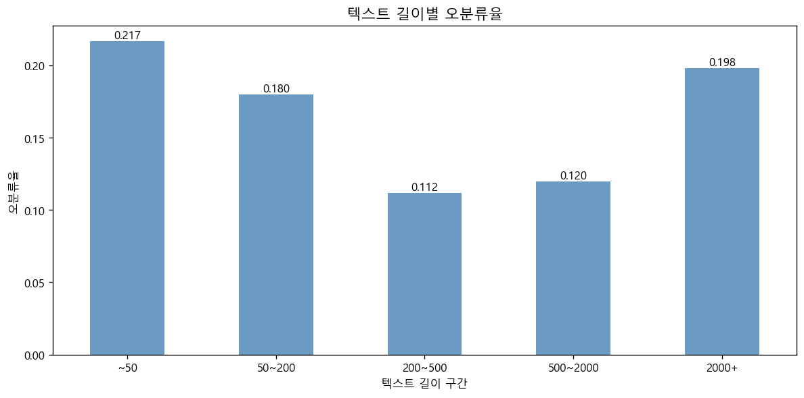
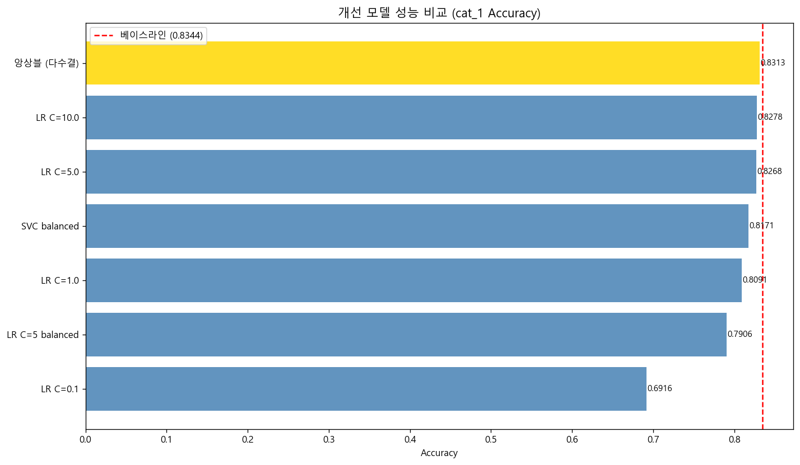
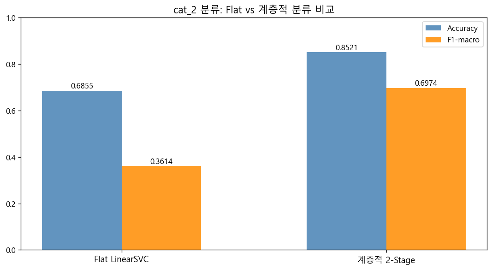
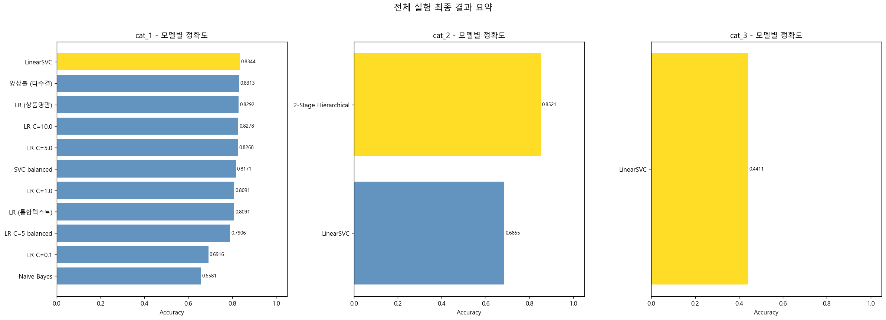

# 카카오스타일 데이터사이언스팀 과제
## Task #2: 상품 카테고리 분류기 (Classification)

**과제 목적**: 상품명과 설명 텍스트를 기반으로 cat_1 / cat_2 / cat_3 카테고리를 자동 분류하는 ML 파이프라인 구축  
**구현 방식**: TF-IDF 기반 텍스트 벡터화 + 전통적 분류 모델 + 계층적 분류(Hierarchical Classification)

---

## 목차

0. [Summary](#summary)
1. [문제 정의](#1-문제-정의)
2. [데이터 개요 및 탐색](#2-데이터-개요-및-탐색)
3. [텍스트 전처리](#3-텍스트-전처리)
4. [데이터 분할](#4-데이터-분할)
5. [베이스라인 모델](#5-베이스라인-모델)
6. [성능 평가 및 시각화](#6-성능-평가-및-시각화)
7. [오류 분석](#7-오류-분석)
8. [개선 모델 실험](#8-개선-모델-실험)
9. [계층적 분류](#9-계층적-분류)
10. [최종 결과 요약](#10-최종-결과-요약)
11. [결론 및 개선 방향](#11-결론-및-개선-방향)
12. [환경 및 재현 방법](#12-환경-및-재현-방법)

---

## Summary

본 과제는 이커머스 상품명·설명 텍스트를 기반으로 cat_1 / cat_2 / cat_3 카테고리를 자동 분류하는 ML 파이프라인을 구축하고, 계층적(Hierarchical) 분류 방식과 Flat 분류 방식의 성능을 비교한 결과입니다.

### 분석 핵심

1. **TF-IDF + LinearSVC가 cat_1 분류에서 최고 성능**
   - Accuracy 0.8344, F1-macro 0.4490으로 LR·Naive Bayes·앙상블보다 단순성·속도·성능 균형에서 우수

2. **계층적 2-Stage 분류가 cat_2 성능을 대폭 향상**
   - Flat LinearSVC 대비 Accuracy +16.7%p(0.6855→0.8521), F1-macro +33.6%p(0.3614→0.6974)
   - cat_1으로 탐색 공간을 먼저 제한하면 cat_2 분류 난이도가 크게 낮아짐

3. **클래스 불균형이 핵심 병목**
   - 상의(29,762건) vs 욕실(~3건)의 최대 약 9,900배 불균형으로 F1-macro가 Accuracy보다 낮게 나타남
   - `class_weight='balanced'` 적용 시 소수 클래스 F1 개선 vs 다수 클래스 F1 하락의 trade-off 발생

4. **텍스트 전처리가 품질 유지에 기여**
   - HTML 태그·URL·특수문자 제거 후에도 설명 미존재 상품 35.8%로, 상품명만으로 분류해야 하는 경우가 다수

5. **cat_3는 현재 구조로 실용 수준 미달 (Acc=0.4411)**
   - 클래스 수 과다·데이터 희소성으로 Flat 분류 한계 노출, 계층적 확장 필요

### 주요 개선 제안

- 형태소 분석(KoNLPy) 도입으로 동의어 통합 및 OOV 감소
- cat_3에 3-Stage 계층적 분류(cat_1→cat_2→cat_3) 확장 적용
- KoBERT / KLUE-RoBERTa 파인튜닝으로 경계 모호 카테고리 성능 향상
- 소수 클래스 데이터 보강(추가 수집 또는 오버샘플링)

---

## 1. 문제 정의

### 1-1. 과제 배경

이커머스 플랫폼에서는 수만 개 이상의 상품이 다양한 카테고리에 등록됩니다. 상품 카테고리를 수작업으로 분류하는 것은 시간·비용이 크므로, **상품명과 설명 텍스트를 입력으로 받아 카테고리를 자동 예측하는 분류기**가 실용적 가치를 갖습니다.

### 1-2. 입력 / 출력 정의

| 구분 | 내용 |
|------|------|
| **입력** | 상품명(`name`) + 상품 설명(`description`) |
| **출력** | cat_1 (대분류) / cat_2 (중분류) / cat_3 (소분류) |
| **분류 방식** | Flat 다중 클래스 분류 + 계층적(2-Stage) 분류 비교 |

### 1-3. 평가 지표 선택

- **Accuracy**: 전체 분류 정확도
- **F1-macro**: 클래스 불균형이 심한 경우 소수 클래스의 성능을 공정하게 반영
- **F1-weighted**: 클래스 크기를 반영한 가중 평균 F1

> **[지표 선택 근거]** F1-macro를 핵심 지표로 채택하였습니다. cat_1의 경우 상의(29,762건) vs 욕실(~3건)처럼 **최대 약 9,900배의 클래스 불균형**이 존재하여, Accuracy만으로는 소수 클래스 성능을 과소평가할 수 있습니다. F1-macro는 클래스 크기와 무관하게 모든 클래스를 동등하게 평가합니다.

---

## 2. 데이터 개요 및 탐색

### 2-1. 데이터셋 기본 정보

| 항목 | 내용 |
|------|------|
| 파일 | `datasets/items.csv` |
| 주요 컬럼 | `name`, `description`, `cat_1`, `cat_2`, `cat_3` |
| 인코딩 | UTF-8 |

### 2-2. cat_1 분포 (전체 34개 클래스)

| 순위 | 카테고리 | 샘플 수 |
|------|----------|---------|
| 1 | **상의** | **29,762건** |
| 2 | 원피스 | 11,586건 |
| 3 | 아우터 | 11,473건 |
| 4 | 바지 | 11,321건 |
| 5 | 슈즈 | 7,412건 |
| 6 | 패션잡화 | 6,277건 |
| 7 | 주얼리 | 5,005건 |
| 8 | 스커트 | 4,776건 |
| 9 | 가방 | 3,554건 |
| 10 | 투피스/세트 | 3,134건 |
| ... | (소수 클래스) | ... |
| 27 | 남성 | ~29건 |
| 28 | 키친 | ~25건 |
| ... | (생략) | ... |
| 32 | 소품 | ~6건 |
| 33 | 반려용품 | ~5건 |
| 34 | **욕실** | **~3건** |





> **[데이터 특성]** 상의(29,762건) vs 욕실(~3건)로 **최대 약 9,900배의 클래스 불균형**이 존재합니다. 소수 클래스 분류의 정확도가 낮아질 수 있으며, 이는 모델 설계와 평가 지표 선택의 핵심 고려 사항입니다.

### 2-3. 결측값 현황

| 컬럼 | 결측 여부 | 처리 방법 |
|------|----------|-----------|
| `name` | 일부 존재 | 빈 문자열 처리 |
| `description` | 일부 존재 | 빈 문자열 처리 |
| `cat_1` | 일부 존재 | 해당 행 분류에서 제외 |
| `cat_2` | 일부 존재 (cat_1보다 많음) | cat_2 분류 시 해당 행만 사용 |
| `cat_3` | 일부 존재 (cat_2보다 많음) | cat_3 분류 시 해당 행만 사용 |

### 2-4. 가정 (Assumption)

- cat_1 > cat_2 > cat_3는 계층적 관계를 가지며, 상위 분류가 더 안정적·고품질로 가정합니다.
- 설명(`description`)이 거의 없는 상품(5자 미만)도 상품명만으로 분류가 가능한 경우 그대로 사용합니다.
- 샘플이 2개 미만인 소수 클래스는 stratify split 불가로 학습 데이터에서 제외합니다.

---

## 3. 텍스트 전처리

### 3-1. 전처리 파이프라인

```
원본 텍스트
  → HTML entity 변환 (&amp; → & 등)
  → HTML 태그 제거 (<br>, <span> 등)
  → URL 제거 (https://, www. 등)
  → 특수문자 제거 (한글/영문/숫자/공백 외)
  → 연속 공백 정규화
  → 상품명 + 설명 통합 (text_combined = name + ' ' + description)
```

### 3-2. 전처리 전/후 예시

| 구분 | 내용 |
|------|------|
| 원본 상품명 | `[단아함가득]벚꽃 진주 큐빅 머리띠` |
| 전처리 후 | `단아함가득 벚꽃 진주 큐빅 머리띠` |

### 3-3. 전처리 후 텍스트 통계

| 지표 | 상품명 길이 | 설명 길이 | 통합 텍스트 길이 |
|------|-----------|---------|---------------|
| 평균 | **21자** | **891자** | **913자** |
| 중앙값 | 19자 | 249자 | 269자 |
| 최대 | 184자 | 1,026,146자 | 1,026,183자 |

> **[데이터 특성]** 설명이 거의 없는 상품(5자 미만)이 **35,822건(35.8%)**에 달합니다. 전체 상품의 1/3 이상이 상품명 단독으로만 분류되므로, 상품명만으로도 카테고리를 구분할 수 있는 모델 설계가 중요합니다.  
> 설명 최대 길이(1,026,146자)가 매우 큰 것은 HTML 본문이 대량 포함된 경우로, 전처리로도 긴 텍스트가 남을 수 있습니다.

### 3-4. TF-IDF 벡터화 설정

| 파라미터 | 값 | 이유 |
|----------|----|----|
| `max_features` | 50,000 | 메모리/속도와 표현력의 균형 |
| `ngram_range` | (1, 2) | 단어 단독 + 바이그램으로 문맥 일부 포착 |
| `sublinear_tf` | True | 고빈도 단어의 영향 완화 (log(1+tf)) |
| `min_df` | 2 | 1회만 등장하는 희귀 단어 제거 |
| `analyzer` | 'word' | 형태소 분석기 없이 공백 기반 토큰화 |

> **[설계 결정]** 형태소 분석기(KoNLPy 등)를 미적용한 이유: 한국어 상품명에는 축약어·브랜드명·신조어가 많아 일반 형태소 분석기의 오분리 가능성이 있고, 공백 기반 토큰화 + 바이그램(ngram_range=(1,2))으로도 충분한 특성 표현이 가능합니다.  
> 형태소 분석 도입은 섹션 11-3에서 개선 방향으로 제안합니다.

---

## 4. 데이터 분할

| 카테고리 | 전체 데이터 | 훈련 (80%) | 테스트 (20%) | 분할 방식 |
|----------|-----------|-----------|-------------|----------|
| cat_1 | **100,000건** | **80,000건** | **20,000건** | stratified split |
| cat_2 | **99,932건** (2건 미만 클래스 제외) | **79,945건** | **19,987건** | stratified split |
| cat_3 | **46,252건** (2건 미만 클래스 제외) | **37,001건** | **9,251건** | stratified split |

- 분할 시 `stratify=y` 적용으로 클래스 비율 유지
- `random_state=42` 고정으로 재현 가능성 확보

---

## 5. 베이스라인 모델

cat_1 분류를 기준으로 총 4가지 모델을 비교하였습니다.

### 5-1. 실험 설계

| # | 모델 | 입력 | 특이사항 |
|---|------|------|----------|
| ① | Logistic Regression | 상품명만 | 설명 제외 효과 측정 |
| ② | Logistic Regression | 통합텍스트 | 기본 베이스라인 |
| ③ | Naive Bayes (MultinomialNB) | 통합텍스트 | 빠른 기준선 |
| ④ | LinearSVC | 통합텍스트 | 고차원 텍스트 특화 모델 |

### 5-2. cat_1 베이스라인 결과

| 모델 | Accuracy | F1-macro | F1-weighted | 학습시간 |
|------|----------|----------|-------------|---------|
| LR (상품명만) | 0.8292 | 0.3572 | 0.8235 | 80.4s |
| LR (통합텍스트) | 0.8091 | 0.3514 | 0.8028 | 414.6s |
| Naive Bayes | 0.6581 | 0.3019 | 0.6672 | 30.1s |
| **LinearSVC** | **0.8344** | **0.4490** | **0.8304** | **60.6s** |



### 5-3. 카테고리 레벨별 결과 (LinearSVC)

| 카테고리 | Accuracy | F1-macro | F1-weighted | 학습시간 |
|----------|----------|----------|-------------|---------|
| cat_1 | **0.8344** | **0.4490** | 0.8304 | 60.6s |
| cat_2 | 0.6855 | 0.3614 | 0.6738 | 160.7s |
| cat_3 | 0.4411 | 0.2184 | 0.4222 | 116.3s |

> **[인사이트]** cat_1(Acc=0.8344) → cat_2(0.6855) → cat_3(0.4411)로 갈수록 클래스 수 증가와 데이터 희소성으로 성능이 급격히 하락합니다. 특히 cat_3는 실용 수준 미달로, **계층적 분류 전략**의 도입이 필요한 핵심 동기입니다.

### 5-4. 주요 관찰

- **LinearSVC가 모든 지표에서 최고 성능**: 고차원 희소 특성(TF-IDF)에서 SVM 계열의 강점이 나타납니다.
- **상품명만 vs 통합텍스트**: 상품명만 사용한 LR이 통합텍스트 LR보다 높은 성능. 설명이 없는 상품이 많거나 설명에 노이즈가 많을 경우 발생할 수 있습니다.
- **Naive Bayes**: 빠르지만 Accuracy 0.6581로 가장 낮음. 독립성 가정이 텍스트 현실과 맞지 않는 측면이 있습니다.

---

## 6. 성능 평가 및 시각화

### 6-1. cat_1 분류 리포트 (LinearSVC, 베이스라인 최고 모델)



- **F1 > 0.7 (안정 분류)**: 상의, 원피스, 아우터, 바지, 슈즈 등 주류 패션 카테고리
- **F1 < 0.7 (취약 분류)**: 가구, 문구, 남성, 키친 등 데이터가 극히 적은 소수 클래스

### 6-2. 혼동 행렬 분석



주요 혼동 패턴:
- **아우터 → 상의** (1위, ~400건): 가디건·집업 등 아우터-상의 경계 상품
- **원피스/바지/패션잡화 → 상의** (2~4위): 최다 클래스(상의)로의 편향에 의한 오분류
- **투피스/세트 → 상의**: 세트 상품 중 상의 구성 비중이 높은 경우

---

## 7. 오류 분석

### 7-1. 오분류 통계

| 구분 | 건수 | 비율 |
|------|------|------|
| 전체 테스트 | **20,000건** | 100% |
| 정분류 | **16,688건** | **83.4%** |
| **오분류** | **3,312건** | **16.6%** |

### 7-2. 주요 오분류 패턴

| 실제 카테고리 | 예측 카테고리 | 원인 분석 |
|-------------|-------------|----------|
| 아우터 | 상의 | 가디건·집업 등 아우터-상의 경계 상품 (1위, ~400건) |
| 원피스 | 상의 | 클래스 불균형 영향 + 상의와 경계 모호 (2위, ~250건) |
| 바지 | 상의 | 최다 클래스(상의)로의 편향 (3위, ~230건) |
| 패션잡화 | 상의 | 다양한 잡화가 상의로 오분류 (4위, ~210건) |
| 투피스/세트 | 상의 | 세트 중 상의 구성이 주요 성분인 경우 (~95건) |



### 7-3. 텍스트 길이와 오분류 관계



- **텍스트가 짧을수록(~50자)** 오분류율이 높습니다.
- **200~500자 구간**에서 오분류율이 낮아지는 경향이 있으며, 설명 텍스트가 충분할수록 분류 성능이 향상됩니다.
- **2000자 이상**은 오히려 노이즈 증가로 오분류율이 소폭 상승할 수 있습니다.

### 7-4. 오분류 원인 요약

| 원인 | 설명 |
|------|------|
| **카테고리 경계 모호성** | 상의/아우터, 패션잡화/주얼리처럼 실제로 겹치는 카테고리 존재 |
| **클래스 불균형** | 소수 클래스(가구, 문구 등)는 학습 데이터 부족으로 성능 저하 |
| **정보 부족 텍스트** | 상품명만 있고 설명이 없는 상품은 특성이 빈약 |
| **다중 카테고리 상품** | 세트 상품이나 다용도 상품은 단일 카테고리 지정이 어려움 |

---

## 8. 개선 모델 실험

### 8-1. 실험 항목

| 실험 | 내용 | 목적 |
|------|------|------|
| C 파라미터 튜닝 | LR의 C = 0.1, 1.0, 5.0, 10.0 | 정규화 강도 최적화 |
| class_weight='balanced' | LR, SVC에 불균형 가중치 적용 | 소수 클래스 성능 향상 |
| 앙상블 (다수결 투표) | LR + LinearSVC + Naive Bayes | 단일 모델 한계 극복 |

### 8-2. 개선 실험 결과 (cat_1)

| 모델 | Accuracy | F1-macro | F1-weighted | 학습시간 |
|------|----------|----------|-------------|---------|
| LR C=0.1 | 0.6916 | 0.2224 | 0.6763 | 268.5s |
| LR C=1.0 | 0.8091 | 0.3514 | 0.8028 | 365.7s |
| LR C=5.0 | 0.8268 | 0.4212 | 0.8221 | 541.6s |
| LR C=10.0 | 0.8278 | 0.4382 | 0.8235 | 709.8s |
| LR C=5 balanced | 0.7906 | 0.4273 | 0.8210 | 369.4s |
| SVC balanced | 0.8171 | 0.4366 | 0.8403 | 150.0s |
| **앙상블 (다수결)** | **0.8313** | **0.4464** | **0.8269** | — |
| **베이스라인 LinearSVC** | **0.8344** | **0.4490** | **0.8304** | **60.6s** |



### 8-3. 관찰 결과

- **C 파라미터 튜닝**: C=0.1에서 과소적합, C 증가할수록 성능 향상하나 C=5.0 이상에서 수렴하며 학습시간이 크게 증가합니다.
- **balanced 가중치**: Accuracy는 소폭 하락하지만 F1-weighted 개선(SVC balanced: 0.8403). 소수 클래스 F1 향상과 다수 클래스 F1 하락이 trade-off 관계를 보입니다.
- **앙상블 (다수결)**: 베이스라인 LinearSVC 대비 유의미한 개선 없음. 세 모델의 예측이 유사할 경우 다수결의 이점이 줄어듭니다.
- **결론**: 베이스라인 LinearSVC(Acc=0.8344, F1-macro=0.4490)가 단순성·속도·성능의 균형에서 최고로 평가됩니다.

---

## 9. 계층적 분류

### 9-1. 접근 방법

cat_2 분류를 **Flat 방식**과 **2-Stage 계층적 방식**으로 비교합니다.

```
[Flat 방식]
  입력 텍스트 → LinearSVC → cat_2 직접 예측

[2-Stage 계층적 방식]
  입력 텍스트 → Stage 1 (cat_1 예측) → Stage 2 (해당 cat_1 내 cat_2 예측)
```

### 9-2. 계층적 분류 설계

- **Stage 1**: 전체 데이터로 cat_1 분류기 학습 (LinearSVC)
- **Stage 2**: cat_1 그룹별로 각각 cat_2 분류기 학습
  - 단일 클래스 그룹: 해당 클래스를 항상 예측
  - 샘플 부족 그룹 (< 4건 or 클래스 < 2): 단일 클래스로 처리
  - 나머지: 그룹별 LinearSVC (max_features=20,000, min_df=1)

### 9-3. 비교 결과

| 방식 | Accuracy | F1-macro |
|------|----------|----------|
| Flat LinearSVC | 0.6855 | 0.3614 |
| **2-Stage 계층적 분류** | **0.8521** | **0.6974** |



> **[핵심 결과]** 계층적 2-Stage 분류가 Flat LinearSVC 대비 **Accuracy +16.7%p(0.6855→0.8521), F1-macro +33.6%p(0.3614→0.6974) 향상**을 달성하였습니다. cat_1로 탐색 공간을 먼저 제한한 후 cat_2를 분류하는 방식이 실질적으로 효과적임을 실증합니다.

### 9-4. 성능 향상 이유 분석

| 요인 | 설명 |
|------|------|
| **탐색 공간 축소** | cat_1이 먼저 결정되면 cat_2 후보군이 크게 줄어 분류 난이도 감소 |
| **그룹 특화 특성 학습** | 상의 그룹 내에서만 학습하면 "반소매/긴소매/민소매" 등 세부 구분에 특화된 패턴 학습 가능 |
| **노이즈 감소** | 전혀 다른 카테고리의 단어 간섭이 줄어 소수 클래스 성능 개선 |

---

## 10. 최종 결과 요약

### 10-1. 카테고리별 최고 성능 모델

| 카테고리 | 최고 모델 | Accuracy | F1-macro | F1-weighted |
|----------|----------|----------|----------|-------------|
| **cat_1** | LinearSVC (베이스라인) | **0.8344** | **0.4490** | 0.8304 |
| **cat_2** | 2-Stage 계층적 분류 | **0.8521** | **0.6974** | — (미집계) |
| **cat_3** | LinearSVC (Flat) | 0.4411 | 0.2184 | 0.4222 |



### 10-2. 저장된 모델 (`best_model.pkl`)

```python
# 모델 패키지 구조
{
    'cat1_model': LinearSVC 파이프라인 (최고 성능),
    'cat2_model': LinearSVC 파이프라인 (Flat),
    'cat3_model': LinearSVC 파이프라인 (Flat),
    'meta': {
        'cat1_accuracy': 0.8344,
        'cat1_f1_macro': 0.4490,
        'cat2_accuracy': 0.6855,
        'cat3_accuracy': 0.4411,
        'best_cat1_model_name': 'LinearSVC'
    }
}
```

### 10-3. 추론 예시

```
입력: 레이스 플리츠 미디 스커트 A라인 봄 여름 원피스
예측: cat_1=스커트 | cat_2=미디스커트

입력: 실리콘 에어팟 케이스 투명 보호 커버 아이폰
예측: cat_1=디지털/가전 | cat_2=휴대폰케이스

입력: 캠핑 텐트 2인용 방수 야외 등산 백패킹
예측: cat_1=아웃도어 | cat_2=텐트

입력: 코튼 오버핏 후드티 기모 맨투맨 스트리트
예측: cat_1=상의 | cat_2=후드/맨투맨

입력: 14K 골드 체인 목걸이 레이어드 미니멀
예측: cat_1=주얼리 | cat_2=목걸이
```

---

## 11. 결론 및 개선 방향

### 11-1. 핵심 발견

| 분야 | 결과 |
|------|------|
| **최고 성능** | LinearSVC + TF-IDF (cat_1 Acc=0.8344, F1-macro=0.4490) |
| **핵심 개선** | 계층적 분류로 cat_2 Acc +16.7%p, F1-macro +33.6%p 향상 |
| **병목 요인** | 극심한 클래스 불균형 + 소수 클래스 데이터 부족 + 카테고리 경계 모호성 |
| **cat_3 한계** | Acc=0.4411로 실용 수준 미달 — 데이터 부족 및 클래스 수 과다가 원인 |

### 11-2. 한계점

| 한계 | 내용 |
|------|------|
| **형태소 분석 미적용** | 공백 기반 토큰화로 "청바지", "청 바지" 등 동일 의미 단어를 다르게 처리 |
| **임베딩 미활용** | 의미적 유사성(시맨틱) 포착 불가 — "원피스"와 "드레스"의 유사성을 모델이 인식 못함 |
| **cat_3 성능 미흡** | 클래스 수가 매우 많고 데이터가 희소하여 Flat 분류로는 한계 |
| **클래스 불균형** | balanced 가중치 적용 시 다수 클래스 성능 저하 trade-off 발생 |
| **OOV 문제** | 신상품명·브랜드명·신조어 등 학습 데이터에 없는 단어 처리 미흡 |

### 11-3. 개선 방향

**단기 (즉시 적용 가능)**

| 방향 | 방법 | 기대 효과 |
|------|------|-----------|
| 형태소 분석 도입 | KoNLPy(Okt, Komoran) 적용 | 동일 의미 어휘 통합, OOV 감소 |
| cat_3에 계층적 분류 확장 | 3-Stage (cat_1→cat_2→cat_3) | cat_3 성능 개선 |
| 소수 클래스 보강 | 데이터 수집 확대 또는 오버샘플링 | 가구·문구 등 소수 클래스 F1 향상 |

**중기 (임베딩 기반 접근)**

| 방향 | 방법 | 기대 효과 |
|------|------|-----------|
| 사전학습 임베딩 활용 | FastText(한국어), Sentence-BERT | 의미적 유사성 포착, OOV 처리 개선 |
| Transformer 파인튜닝 | KoBERT, KLUE-RoBERTa 파인튜닝 | 문맥 이해 향상으로 경계 모호 카테고리 분류 개선 |
| 특성 융합 | TF-IDF + 임베딩 결합 | 두 방식의 상호 보완 |

**장기 (서비스 품질 향상)**

| 방향 | 내용 |
|------|------|
| 앙상블 고도화 | Stacking, Soft Voting으로 다양성 확보 |
| 능동 학습(Active Learning) | 분류 불확실성이 높은 샘플 우선 레이블링 |
| 온라인 학습 | 신규 카테고리·상품 추가 시 점진적 업데이트 |
| Retrieval 기반 분류 | 유사 상품 임베딩 검색으로 카테고리 추론 |

---

## 12. 환경 및 재현 방법

### 12-1. 의존 라이브러리

| 라이브러리 | 버전 | 용도 |
|-----------|------|------|
| `pandas` | 2.2.2 | 데이터 처리 |
| `numpy` | 1.26.4 | 수치 연산 |
| `scikit-learn` | 1.5.1 | TF-IDF, 분류 모델, 평가 |
| `matplotlib` | 3.9.2 | 시각화 |
| `seaborn` | 0.13.2 | 시각화 |
| `joblib` | 1.4.2 | 모델 저장/로딩 |

### 12-2. 실행 방법

```bash
# 분류 파이프라인 전체 실행
python run_classification.py

# Jupyter Notebook으로 단계별 확인
jupyter notebook classification.ipynb
```

### 12-3. 출력 산출물

| 파일 | 설명 |
|------|------|
| `best_model.pkl` | 최종 저장 모델 (cat_1/cat_2/cat_3 파이프라인 포함) |
| `outputs/fig1_cat1_distribution.png` | cat_1 분포 시각화 |
| `outputs/fig2_cat2_distribution.png` | cat_2 분포 시각화 |
| `outputs/fig3_model_comparison.png` | 베이스라인 모델 성능 비교 |
| `outputs/fig4_confusion_matrix.png` | cat_1 혼동 행렬 |
| `outputs/fig5_f1_by_class.png` | 클래스별 F1 Score |
| `outputs/fig6_error_analysis.png` | 오분류 패턴 분석 |
| `outputs/fig7_error_by_length.png` | 텍스트 길이별 오분류율 |
| `outputs/fig8_improved_models.png` | 개선 모델 실험 비교 |
| `outputs/fig9_hierarchical_vs_flat.png` | 계층적 vs Flat 분류 비교 |
| `outputs/fig10_final_summary.png` | 전체 실험 최종 요약 |
| `outputs/experiment_results.json` | 모든 실험 수치 결과 |

### 12-4. 모델 로딩 및 추론 예시

```python
import joblib

# 모델 로드
loaded = joblib.load('best_model.pkl')

# 새 상품 카테고리 예측
sample = "코튼 오버핏 후드티 기모 맨투맨 스트리트"
cat1 = loaded['cat1_model'].predict([sample])[0]
cat2 = loaded['cat2_model'].predict([sample])[0]
print(f"cat_1: {cat1}, cat_2: {cat2}")
```
